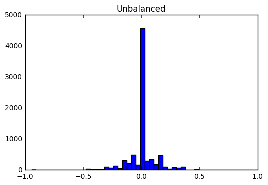
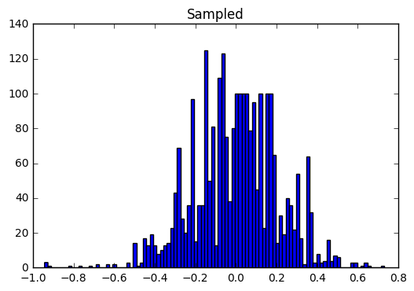
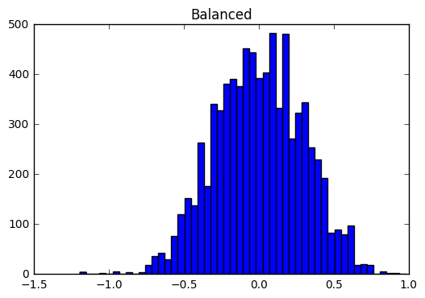

#**Behavioral Cloning** 

---

**Behavrioal Cloning Project**

The goals / steps of this project are the following:
* Use the simulator to collect data of good driving behavior
* Build, a convolution neural network in Keras that predicts steering angles from images
* Train and validate the model with a training and validation set
* Test that the model successfully drives around track one without leaving the road
* Summarize the results with a written report


[//]: # (Image References)

[image1]: ./examples/placeholder.png "Model Visualization"
[image2]: ./examples/placeholder.png "Grayscaling"
[image3]: ./examples/placeholder_small.png "Recovery Image"
[image4]: ./examples/placeholder_small.png "Recovery Image"
[image5]: ./examples/placeholder_small.png "Recovery Image"
[image6]: ./examples/placeholder_small.png "Normal Image"
[image7]: ./examples/placeholder_small.png "Flipped Image"

## Rubric Points
###Here I will consider the [rubric points](https://review.udacity.com/#!/rubrics/432/view) individually and describe how I addressed each point in my implementation.  

---
###Files Submitted & Code Quality

####1. Submission includes all required files and can be used to run the simulator in autonomous mode

My project includes the following files:
* model.py containing the script to create and train the model
* drive.py for driving the car in autonomous mode
* model.h5 containing a trained convolution neural network 
* writeup_report.md or writeup_report.pdf summarizing the results

####2. Submssion includes functional code
Using the Udacity provided simulator and my drive.py file, the car can be driven autonomously around the track by executing 
```sh
python drive.py model.h5
```

####3. Submssion code is usable and readable

The model.py file contains the code for training and saving the convolution neural network. The file shows the pipeline I used for training and validating the model, and it contains comments to explain how the code works.

###Model Architecture and Training Strategy

####1. An appropriate model arcthiecture has been employed

My model consists of a convolution neural network with three 5x5 and two 3x3 filter sizes and depths between 24 and 64 (model.py lines 53-60). Convolution network is followed by 5 fully connected layers (model.py lines 63-67).

The data is normalized in the model using a Keras lambda layer (code line 49). 

####2. Attempts to reduce overfitting in the model

The model contains dropout layers in last 3 out of 5 convolution layers,  in order to reduce overfitting (model.py lines 56,58,60). 

The data was balanced such that the steering angle follows the normal distribution. Since steering angle was biased around 0 degree, hence steering angle around 0 degrees was removed to make distribution normal. The model was trained and validated on different data sets to ensure that the model was not overfitting (code line 69). I used 20% as validation set. The model was tested by running it through the simulator and ensuring that the vehicle could stay on the track.


####3. Model parameter tuning

The model used an adam optimizer, so the learning rate was not tuned manually (model.py line 69).

####4. Appropriate training data

Udacity Training Data was used. The model was trained on all three camera feeds. Steering angle corresponding to left and right images was altered by adding and subtracting 0.25 degrees respectively. 

For details about how I created the training data, see the next section. 

###Model Architecture and Training Strategy

####1. Solution Design Approach

My first step was to use a convolution neural network on centre images (as discussed in the lectures). But results were very discouraging because the data was skewed or biased towards 0 degrees and then towards left. The car could barely pass the second curve.

Data near 0 degrees was removed to make the distribution normal. Steering angle was distributed in 100 bins and it was made sure that central bins (close to 0 degrees) do not include more than 100 records. This resulted in some-what normally distributed records w.r.t steering angle. To further balance the data I also added left & right camera images and adjusted the steering angle by adding and subtracting 0.25 degrees respectively.

In order to gauge how well the model was working, I split my image and steering angle data into a training and validation set. I found that my first model had a low mean squared error on the training set but a high mean squared error on the validation set. This implied that the model was overfitting. 

To combat the overfitting, I modified the model and added dropout layers.

The final step was to run the simulator to see how well the car was driving around track one. The drive was jittery but the car stayed on the track all the times.


####2. Final Model Architecture

The final model architecture (model.py lines 48-67) consisted of a convolution neural network with the following layers and layer sizes:

**Layer 1:** 2D Convolution Layer 5x5 filter 24 output depth & 'relu' activation
**Layer 2:** 2D Convolution Layer 5x5 filter 36 output depth & 'relu' activation
**Layer 3:** 2D Convolution Layer 5x5 filter 48 output depth & 'relu' activation
**Layer 4:** Dropout Layer Drop Probability 0.2
**Layer 5:** 2D Convolution Layer 3x3 filter 64 output depth & 'relu' activation
**Layer 6:** Dropout Layer Drop Probability 0.2
**Layer 7:** 2D Convolution Layer 3x4 filter 64 output depth & 'relu' activation
**Layer 8:** Dropout Layer Drop Probability 0.2
**Layer 9:** Flatten
**Layer 10:** Dense Layer with 100 nodes
**Layer 11:** Dense Layer with 50 nodes
**Layer 12:** Dense Layer with 10 nodes
**Layer 13:** Dense Layer with 1 node


####3. Creation of the Training Set & Training Process

**Udacity's training data was used**

Initially the steering angle was biased:


Data was sampled such that the near 0 degree records are <= 100:


Left and Right camera images were added, with adjusted angles:



Finally, I randomly shuffled the data set and put 20% of the data into a validation set. 

I used this training data for training the model. The validation set helped determine if the model was over or under fitting. The ideal number of epochs was around 4-5, mse was not improving much after that. I used an adam optimizer so that manually training the learning rate wasn't necessary.
